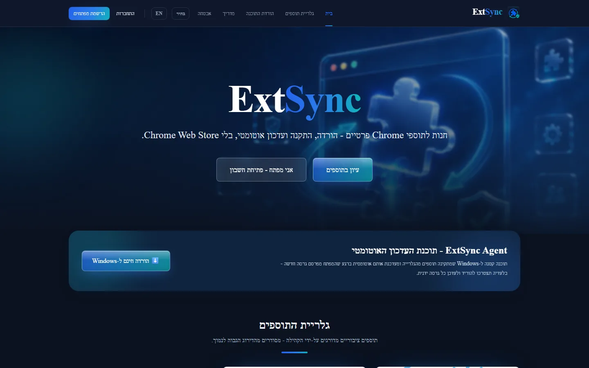

# ExtSync

**הפצה, התקנה ועדכון אוטומטי של תוספי Chrome פרטיים - מחוץ ל-Chrome Web Store.**

[🌐 extsync.com](https://extsync.com) · [📦 חנות](https://extsync.com/store) · [📖 מדריך](https://extsync.com/docs) · [🇬🇧 English](README.md)

## מה זה ExtSync?

ExtSync היא פלטפורמה להפצה, התקנה, ניהול ו**עדכון אוטומטי של תוספי Chrome (Manifest V3) פרטיים מחוץ ל-Chrome Web Store** - לתוספים פרטיים, ניסיוניים וצוותיים.

כל גרסה **חתומה ב-Ed25519** ומאומתת SHA-256. תוכנת Agent קטנה ל-Windows מתקינה את התוסף פעם אחת, ומשם שומרת אותו מעודכן אוטומטית - עם החזרה-אוטומטית (rollback) במקרה של עדכון כושל.

> ExtSync אינה תחליף ל-Chrome Web Store. בהתקנה הראשונה של תוסף לא ארוז, המשתמש עדיין חייב להפעיל "מצב מפתח" ולטעון את התיקייה פעם אחת ב-`chrome://extensions`. ExtSync הופכת את השלב הזה לפשוט ככל האפשר, ומנהלת את **כל** העדכונים שאחריו. ראו [architecture/limitations.md](docs/architecture/limitations.md).

## עיקרי הדברים

- 🔐 **גרסאות חתומות** - חתימת Ed25519 על מטא-דאטה קנונית, שנוצרת בשירות חתימה מבודד רשתית; ה-Agent מסרב לכל התקנה ללא חתימה תקינה ו-SHA-256 תואם.
- 🔄 **עדכונים אוטומטיים** - ה-Agent בודק, מאמת ומחיל עדכונים, עם rollback אוטומטי והשהיית-הפצה אוטומטית כשאחוז הכשלים גבוה.
- 🧪 **צינור ולידציה** - כל העלאה נסרקת ב-worker מבודד (ZIP-slip, path traversal, קוד מרוחק, אי-התאמת manifest) ומקבלת ציון סיכון לפני פרסום.
- 🌗 **אתר מוקפד** - חנות ציבורית ולוח בקרה למפתחים; דו-לשוני עברית/אנגלית, מצב כהה כברירת מחדל, SSR + SEO.
- 🛡️ **אבטחה תחילה** - Argon2id, JWT עם אלגוריתם נעול, רוטציית refresh-token עם זיהוי גניבה, הרשאות חסינות-IDOR, הגנת SSRF ל-webhooks, ו-CSP מבוסס-nonce.

## צילומי מסך

| חנות ציבורית | לוח בקרה למפתח |
|---|---|
|  | התחברו ב-[extsync.com](https://extsync.com) |

## ארכיטקטורה

| רכיב | תיקייה | טכנולוגיה | תפקיד |
|------|--------|-----------|-------|
| אתר | `apps/web` | Next.js + TS | אתר ציבורי, לוח בקרה למפתח, דף התקנה, Admin |
| API | `apps/api` | FastAPI + SQLAlchemy | מקור האמת: משתמשים, פרויקטים, גרסאות, חתימות |
| Worker | `apps/worker` | Python | ניתוח ZIP מבודד, ולידציה, אריזת Artifact |
| Signing | `apps/api` (`extsync_signing`) | Python | שירות חתימה Ed25519 מבודד רשתית |
| Agent | `apps/agent-windows` | C# / WPF | תוכנת Windows שמתקינה ומעדכנת תוספים |
| Native Host | `apps/native-host` | C# | גשר Native Messaging בין Chrome ל-Agent |
| Bridge | `packages/extension-bridge` | TypeScript | חבילה שמשולבת בתוסף לטעינה-מחדש מאומתת |
| CLI | `apps/cli` | Node / TS | `extsync` - init / validate / pack / upload / publish |
| Schema | `packages/release-schema` | JSON Schema + TS/Py | פורמט Metadata + חתימה, מקור אמת חוצה-שפות |

לעומק: [סקירת ארכיטקטורה](docs/architecture/overview.md) · [החלטות ארכיטקטורה (ADR)](docs/architecture/adr) · [חתימה](docs/security/signing.md) · [תהליך מקצה-לקצה](docs/developer-guide/end-to-end.md).

## Source-available, לא קוד פתוח

הריפו ציבורי כדי שאפשר יהיה **לקרוא ולבקר את הקוד**. ExtSync הוא מוצר אמיתי ומתארח ([extsync.com](https://extsync.com)) - לא ערכת התקנה-עצמית - והקוד **אינו** מורשה לשימוש חוזר או לאחסון בפרודקשן. ראו [LICENSE](LICENSE).

בנייה מקומית לצורך סקירת הקוד: [developer-guide/getting-started.md](docs/developer-guide/getting-started.md).

## יצירת קשר

נבנה על ידי אברהם גלסר - <glasser.avraham@gmail.com>

